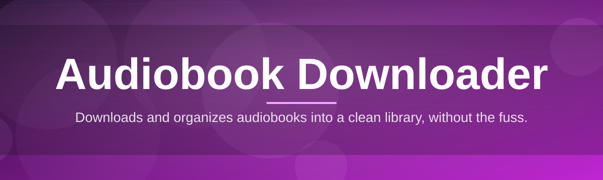
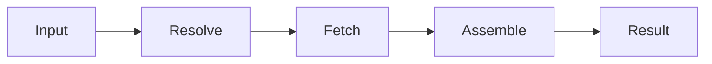

# audiobook-downloader-utility 🎧📚

  

*One tray icon, one queue, zero patience wasted on spinning progress bars.*

| Requirement | Minimum |
|---|---|
| OS | Windows 10 (64-bit) or Windows 11 |
| RAM | 4 GB |
| Disk | 500 MB free + space for your library |
| .NET runtime | Bundled — you install nothing extra |
| Internet | Required for fetching, obviously |

---

## 🧭 Overview

Audiobooks are the last format that still treats you like a hostage — proprietary apps, locked players, and progress bars that lie. **audiobook-downloader-utility** exists to give listeners a single, no-nonsense tool that fetches, organizes, and hands you your audio files without fifteen browser tabs and a prayer.

This isn't a media player pretending to be a downloader, and it's not a download manager pretending to understand audiobooks. It's built specifically around long-form audio: chapters, metadata, cover art, series ordering — the stuff that actually matters when you've got a 40-hour fantasy epic queued up for your commute.

Built for people who read with their ears — commuters, night-shift workers, folks who "read" three books a week and none of them on paper. If you've ever lost a download at 87% and rage-quit, this tool was written with your specific frustration in mind.

  

> [!TIP]
> Pin the app to your taskbar. You'll use it more than you think — audiobook queues have a way of growing overnight.

---

## 🔥 What It Actually Does

| Capability | Why You'll Care |
|---|---|
| **Batch queueing** | Drop ten links in, walk away, come back to ten finished files. No babysitting. |
| **Smart chapter detection** | Splits and labels chapters automatically — no more one giant 12-hour blob file. |
| **Metadata auto-tagging** | Cover art, author, narrator, series index — all filled in without you typing a thing. |
| **Resume-on-failure** | Connection drops mid-download? It picks up where it left off, not from zero. |
| **Format flexibility** | Output in M4B, MP3, or FLAC depending on what your player actually respects. |
| **Duplicate detection** | Already have book 3 of that series? It tells you before you waste bandwidth. |
| **Bandwidth throttling** | Cap your speed so downloading doesn't murder your video call. |
| **Dark & light themes** | Because staring at a bright white queue at 1 AM is a crime against your eyes. |

---

## 🚀 Getting Started

1. Visit the landing page using the download button above.

2. Grab the latest Windows build — it's a single portable executable.

3. Run it. No installer wizard, no "Next, Next, Next" theater.

4. Paste your source, hit queue, and let the utility do the boring part.

> [!NOTE]
> First launch takes a beat longer while it initializes local caches. Every launch after that is instant.

---

## 🖥️ System Requirements

- **OS:** Windows 10 or Windows 11, 64-bit only

- **Dependencies:** None. It's standalone — no runtime installs, no background services

- **Storage:** Audiobooks are large; budget accordingly (a single title can run 300MB–1GB+)

- **Permissions:** Standard user account is fine — no admin rights required

> [!IMPORTANT]
> This is a Windows-native build. There is no macOS or Linux binary, and there isn't a browser extension pretending to be one.

---

## ⚙️ How It Works

The pipeline is deliberately boring — boring means reliable:

1. **Input** — you provide a source link or file reference.

2. **Resolve** — the utility identifies format, chapters, and available metadata.

3. **Fetch** — data streams down in parallel chunks with automatic retry.

4. **Assemble** — chapters, tags, and cover art get stitched into one clean file.

5. **Deliver** — finished audiobook lands in your chosen folder, ready to play.

---

## 🧩 Troubleshooting

<strong>The download stalls at a random percentage.</strong>

Usually a network hiccup, not a bug. The resume engine should pick it back up within a few seconds — if it doesn't, cancel and requeue that single item.

<strong>My audiobook has no chapters, just one long file.</strong>

The source didn't expose chapter markers. Try re-adding it — chapter detection sometimes needs a second pass to read embedded timing data correctly.

<strong>Cover art shows a placeholder image.</strong>

Metadata lookup occasionally misses obscure or self-published titles. You can manually drop in artwork via the item's right-click menu.

<strong>The app won't launch after a Windows update.</strong>

Rare, but Windows sometimes flags new executables. Unblock the file in its Properties panel and relaunch.

<strong>Queue says "complete" but the file is missing.</strong>

Check your configured output folder — if it was on a removable drive that got unplugged mid-run, the file may have landed in the fallback temp directory instead.

---

## 🎨 UI / UX Details

> [!TIP]
> Keyboard shortcuts turn the queue from a chore into muscle memory.

| Shortcut | Action |
|---|---|
| `Ctrl + N` | Add new item to queue |
| `Ctrl + Enter` | Start all queued downloads |
| `Space` | Pause / resume selected item |
| `Delete` | Remove item from queue |
| `Ctrl + D` | Toggle dark/light theme |
| `Ctrl + ,` | Open settings panel |

Settings persist locally — themes, throttle limits, and default output folder all remember what you told them last time.

---

## 🤝 Contributing & Community

This project grows because people who actually use it keep poking holes in it — that's a compliment, not a complaint.

- Found a bug? Open an issue with steps to reproduce.

- Got an idea? Discussions are open, opinions welcome.

- Want to contribute code? Fork it, branch it, PR it — small focused changes merge faster than sprawling ones.

  

> [!WARNING]
> Please search existing issues before filing a duplicate. There's a decent chance someone already yelled about it.

---

## 📜 License

Released under the [MIT License](LICENSE), 2026. Use it, fork it, ship it in your own project — just keep the license notice intact.

---

## ⚖️ Disclaimer

This utility is a tool, not a legal opinion. You're responsible for ensuring you have the right to download and use any content you queue through it. The maintainers assume no liability for how it's used.

---

  

